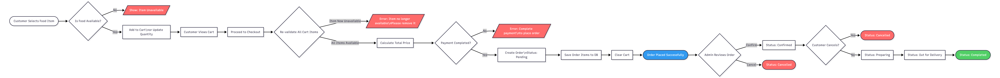
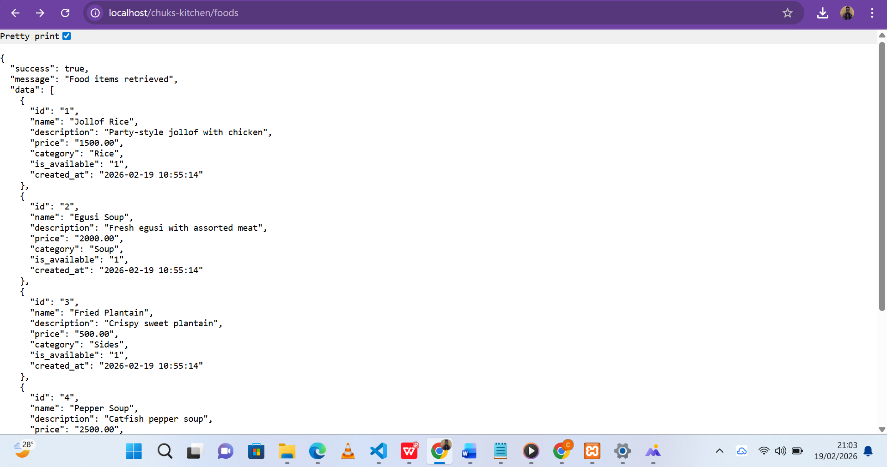

# Chuks Kitchen - Backend API Documentation

**Internship:** Trueminds Innovations Ltd - Backend Developer Deliverable 1
**Developer Role:** Backend Developer Intern
**Project:** Food Ordering & Customer Management System
**Client:** Mr. Chukwudi Okorie (Chuks Kitchen)
**Stack:** PHP (Plain) · MySQL · XAMPP
**Period:** Feb 13th - Feb 27th, 2025

---

## Table of Contents

1. [System Overview](#1-system-overview)
2. [Flow Explanation](#2-flow-explanation)
3. [Edge Case Handling](#3-edge-case-handling)
4. [Assumptions](#4-assumptions)
5. [Scalability Thoughts](#5-scalability-thoughts)
6. [API Endpoint Reference](#6-api-endpoint-reference)
7. [Database Schema Summary](#7-database-schema-summary)
8. [How to Run the Project](#8-how-to-run-the-project)

---

## 1. System Overview

### What is Chuks Kitchen?

Chuks Kitchen is a digital food ordering platform built for Mr. Chukwudi Okorie to help
his food business move online. The system allows customers to register, browse a food
menu, add meals to a cart, place orders, and track their order status in real time.
On the admin side, the Chuks Kitchen team can manage food items, update prices,
mark items as unavailable, and manage incoming orders.

### How the Full System Works (End-to-End)

The system is built as a **RESTful API** using plain PHP and MySQL. The frontend
(mobile app or web browser) communicates with the backend by sending HTTP requests
(GET, POST, PUT, DELETE) to defined API endpoints. The backend processes each
request, interacts with the MySQL database, and returns a JSON response.

Here is a high-level picture of how everything connects:

```
[Customer / Admin App]
        |
        | HTTP Request (JSON)
        ▼
[PHP Backend API — chuks-kitchen/]
        |
        | SQL Queries
        ▼
[MySQL Database — chuks_kitchen]
        |
        | Results
        ▼
[PHP Backend API]
        |
        | JSON Response
        ▼
[Customer / Admin App]
```

### The Two User Types

**Customer**
A registered and verified user who can browse the menu, add items to their cart,
place and track orders.

**Admin (Chuks Kitchen Team)**
A trusted team member who can add and update food items, change prices, mark
items as unavailable, and manage order statuses.

### Core Modules

| Module | What it does |
|--------|-------------|
| Auth | Handles user registration and OTP-based account verification |
| Food/Menu | Manages food items — listing, adding, and availability |
| Cart | Allows customers to build their order before checkout |
| Orders | Handles order creation, tracking, and cancellation |

---

## 2. Flow Explanation

### A. User Registration & Verification Flow


**Step 1 - User submits signup form**
The customer provides their name, email address or phone number, and an optional
referral code. The frontend sends this data to `POST /signup`.

**Step 2 - Duplicate check**
The backend immediately checks the database to see if the email or phone number
already exists. If a duplicate is found, the system returns an error and stops the
process. This prevents two accounts from sharing the same identity.

**Step 3 - Referral code validation**
If the user entered a referral code, the system looks it up in the users table. If no
matching code is found, the system returns an "Invalid referral code" error. This
protects the referral system from being abused with random codes.

**Step 4 - OTP Generation**
If all checks pass, the backend generates a random 6-digit OTP and sets an expiry
time of 10 minutes from the current moment. The user record is saved to the database
with `is_verified = 0`, meaning the account is not yet active.

**Step 5 - OTP Delivery (Simulated)**
In a real production system, the OTP would be sent to the user's email via a mail
service like Mailgun or to their phone via an SMS provider like Termii. In this
internship project, the OTP is returned directly in the API response to simulate
this behavior.

**Step 6 - User submits OTP**
The user copies the OTP and sends it to `POST /verify` along with their email address.

**Step 7 - OTP Validation**
The backend fetches the user's stored OTP and expiry time. It checks two things:
first, whether the submitted OTP matches the stored one; second, whether the current
time is still within the 10-minute window. If either check fails, an appropriate error
is returned.

**Step 8 - Account Activation**
If both checks pass, the backend sets `is_verified = 1` and clears the OTP from the
database. The account is now active and the customer can use the platform.

---

### B. Food Browsing Flow

**Step 1 - Customer requests food list**
The frontend sends `GET /foods`. No authentication is required for browsing.

**Step 2 - Backend queries available items**
The backend queries the foods table and returns only items where `is_available = 1`.
Unavailable items are hidden from customers automatically.

**Step 3 - Admin adds or updates food**
When the admin needs to add a new meal, they send a `POST /foods` request with the
food name, description, price, and category. The backend validates that a name and
valid price are provided before saving.

---

### C. Cart Flow

**Step 1 - Customer adds item to cart**
The customer selects a food item and sends `POST /cart` with their user ID, the food
ID, and the quantity they want.

**Step 2 - Availability check at cart stage**
Before adding the item, the backend checks if the food is still available. If the item
has been marked unavailable by the admin, the system immediately returns an error
rather than allowing the customer to cart an item they cannot order.

**Step 3 - Duplicate cart item handling**
If the customer tries to add an item they already have in their cart, the backend
updates the quantity instead of creating a duplicate row. This keeps the cart clean.

**Step 4 - View cart**
The customer can call `GET /cart/{user_id}` at any time to see all their cart items,
the subtotal per item, and the running total for the full cart.

**Step 5 - Clear cart**
The customer or the system can call `DELETE /cart/clear/{user_id}` to empty the cart.
This also happens automatically after a successful order is placed.

---

### D. Ordering Flow



**Step 1 - Customer initiates checkout**
The customer sends `POST /orders` with their user ID and payment status.

**Step 2 - Cart retrieval**
The backend fetches all items currently in the customer's cart, joined with food
details from the foods table.

**Step 3 - Empty cart check**
If the cart is empty, the backend immediately returns an error. An order cannot be
created without items.

**Step 4 - Re-validation of item availability**
This is a critical step. Even though availability was checked when items were added
to the cart, the backend checks availability again at checkout. This is because
a food item could become unavailable between the time it was added to the cart
and the time the order is placed.

**Step 5 - Total price calculation**
The backend multiplies each item's price by its quantity and sums everything up
to get the order total.

**Step 6 - Payment check (simulated)**
The backend checks whether the payment_status field in the request is set to "paid".
If it is not, the order is blocked and a payment error is returned. In a real system,
this step would involve calling a payment gateway like Paystack or Flutterwave and
confirming the transaction reference.

**Step 7 - Order creation**
If everything is valid, the backend creates a new order record with status "pending",
saves each item as an order_item record, and clears the customer's cart.

**Step 8 - Order status lifecycle**
Once placed, the order moves through the following stages managed by the admin:

```
Pending → Confirmed → Preparing → Out for Delivery → Completed
                    ↘ Cancelled (only before Preparing stage)
```

**Step 9 - Cancellation**
A customer or admin can cancel an order only while it is in "pending" or "confirmed"
status. Once the kitchen starts preparing, cancellation is no longer allowed.

---

### E. User Roles Flow


This diagram shows the two system roles and what each can do.
A Customer can browse food, manage their cart, place orders and
track order status. An Admin can add food items, update prices,
mark items unavailable, and manage all orders.

## 3. Edge Case Handling

This section explains every unusual or failure scenario the system is designed to handle.

### Registration Edge Cases

**Duplicate Email or Phone Number**
When a user tries to register with an email or phone that already exists in the
database, the system returns a 409 Conflict error with a clear message. The new
record is not created. This prevents multiple accounts from sharing identity details.

**Invalid Referral Code**
If a user enters a referral code that does not match any existing user's code in
the system, the backend returns a 400 Bad Request error. The signup is blocked
until the user either corrects the code or removes it.

**User Abandons Signup Midway**
If a user submits the signup form but never verifies their OTP, their record remains
in the database with `is_verified = 0`. These inactive accounts do not affect the
system's behavior. In a production system, a scheduled cleanup job (cron job)
would delete unverified accounts older than 24 hours.

**Invalid OTP**
If the user submits an OTP that does not match what is stored in the database,
the system returns a 400 error with the message "Invalid OTP". The account
remains unverified.

**Expired OTP**
OTPs are valid for only 10 minutes. If the user submits the correct OTP after
the expiry window, the system returns a 400 error with the message "OTP has
expired. Please request a new one." A resend OTP endpoint would be added
in a production version.

**Already Verified Account**
If a user tries to verify an account that is already active, the system detects
`is_verified = 1` and returns an error rather than processing the OTP again.

---

### Cart Edge Cases

**Food Item Unavailable When Adding to Cart**
If a customer tries to add a food item that has been marked unavailable by the
admin, the system checks `is_available` before inserting into the cart and returns
a clear error message. The item is not added.

**Duplicate Item in Cart**
Instead of creating two separate cart rows for the same food item, the system
detects the existing entry and updates its quantity. This keeps the cart clean
and prevents confusion during checkout.

---

### Order Edge Cases

**Empty Cart at Checkout**
If the customer calls the order endpoint but their cart is empty, the system
returns a 400 error immediately. No order record is created.

**Food Becomes Unavailable After Being Added to Cart**
This is handled by re-validating every cart item at the moment of checkout.
If any item in the cart has been marked unavailable between the time it was
added and the time the order is placed, the system returns an error naming
the specific item and asks the customer to remove it before continuing.

**Payment Not Completed**
If the customer sends the order request without completing payment
(payment_status is not "paid"), the backend returns a 402 Payment Required
error. The order is not created and the cart is preserved so the customer
can retry after paying.

**Order Cancellation After Preparation Has Started**
Cancellation is only permitted when the order status is "pending" or "confirmed".
If the admin has already moved the order to "preparing", the system returns a
400 error explaining that the order cannot be cancelled at its current stage.

**Order Not Found**
If a GET or PUT request is made with an order ID that does not exist in the
database, the system returns a 404 Not Found error.

---

## 4. Assumptions

The following assumptions were made during the design and development of this
project due to missing production details or internship scope limitations:

1. **OTP delivery is simulated.** The system returns the generated OTP directly
   in the API response. In a real production system, this would be sent via email
   (e.g. Mailgun, SendGrid) or SMS (e.g. Termii, Twilio) and would never be
   exposed in the API response.

2. **Payment is simulated.** Payment processing is handled by checking a
   `payment_status` field passed in the request body. A real system would
   integrate with Paystack or Flutterwave, verify a transaction reference,
   and only create the order after the gateway confirms a successful charge.

3. **No authentication middleware is implemented.** User IDs are passed
   directly in request bodies. In production, users would receive a JWT token
   after login and all requests would be authenticated using that token in
   the Authorization header.

4. **Admin role is not enforced.** The food management endpoints (POST /foods)
   are open in this implementation. A production system would check the user's
   role from a verified JWT token before allowing admin actions.

5. **OTP resend is not implemented.** If an OTP expires, the user currently
   has no way to request a new one through the API. This endpoint would be
   added in a production version.

6. **Phone-based OTP is not implemented.** Only email-based registration and
   OTP flow is covered. Phone number is stored but not used for OTP delivery.

7. **No image upload for food items.** Food items do not have photos in this
   implementation. A production system would handle image uploads to a cloud
   storage service like AWS S3 or Cloudinary.

8. **Delivery address is not collected.** Orders are created without a delivery
   address. A production system would require customers to save a delivery
   address as part of the checkout flow.

---

## 5. Scalability Thoughts

### Current State (Up to ~100 Users)

The current setup — a single PHP application running on XAMPP with one MySQL
database — is perfectly appropriate for a prototype and internship deliverable.
All requests are handled by one server and one database instance.

---

### Growing to 1,000 Users

At this stage the system would need:

**Proper Authentication:** Replace user_id in request bodies with JWT tokens.
Every API call would validate the token before processing, ensuring that users
can only access their own data.

**Environment Configuration:** Move database credentials out of the code and
into environment variables or a `.env` file so they are not exposed in version
control.

**Input Sanitization & Validation Layer:** Add a dedicated validation layer to
every controller to sanitize all inputs before they touch the database, protecting
against SQL injection and malformed data.

**OTP via Real Provider:** Integrate Termii or Mailgun so OTPs are delivered
via SMS or email instead of being returned in the response.

---

### Growing to 10,000+ Users

At this scale, the architecture needs to evolve significantly:

**Database Read Replicas:** A single MySQL instance becomes a bottleneck when
thousands of users are reading data simultaneously. The solution is a
primary-replica setup where the primary handles all writes (INSERT, UPDATE,
DELETE) and one or more replicas handle all reads (SELECT). Food listings
and order status checks — which are read-heavy — would be routed to replicas.

**Caching with Redis:** The food menu (`GET /foods`) is requested very frequently
but changes rarely. Adding Redis as a caching layer means the backend only hits
the database once to load the menu, stores the result in Redis, and serves
subsequent requests from memory. This reduces database load dramatically.
Cache would be invalidated whenever an admin adds or updates a food item.

**Cart in Redis:** At high scale, the cart can be moved entirely into Redis
with automatic expiry (TTL). This makes cart reads and writes extremely fast
since they never touch the relational database until checkout.

**Load Balancer + Multiple App Servers:** A single PHP server has a limit on
how many requests it can handle at once. At 10,000+ users, traffic would be
distributed across multiple app servers sitting behind an Nginx load balancer.
Each server runs the same PHP application and reads from the same database.

**Queue System for OTP and Notifications:** Sending emails and SMS messages
inline (inside the API request cycle) slows down the response. A queue system
like RabbitMQ or Redis Queues would handle these tasks asynchronously.
The API responds immediately and a background worker processes the email/SMS
delivery separately.

**Monitoring and Logging:** At scale, errors and slow queries need to be
tracked proactively. Tools like Sentry (for error tracking) and Grafana with
Prometheus (for performance monitoring) would be added to give the engineering
team visibility into the system's health.

**CDN for Static Assets:** Food item images and other static files would be
served through a Content Delivery Network (CDN) like Cloudflare, reducing
load on the application server and delivering assets faster to users
across different regions.

---

### Summary Table

| Scale | Key Changes Needed |
|-------|--------------------|
| 100 users | Current setup works fine |
| 1,000 users | JWT auth, real OTP provider, input validation |
| 5,000 users | Read replicas, Redis cache for menu |
| 10,000+ users | Load balancer, Redis cart, async queues, monitoring |

---

## 6. API Endpoint Reference

### Live API Test — Food Listing Endpoint
The screenshot below shows the `GET /foods` endpoint returning 
all available food items successfully from the database:



| Method | Endpoint | Description |
|--------|----------|-------------|
| POST | /signup | Register a new user |
| POST | /verify | Verify account with OTP |
| GET | /foods | List all available food items |
| POST | /foods | Add a new food item (Admin) |
| POST | /cart | Add item to cart |
| GET | /cart/{user_id} | View cart with totals |
| DELETE | /cart/clear/{user_id} | Clear entire cart |
| POST | /orders | Place order from cart |
| GET | /orders/{id} | Get order details and status |
| PUT | /orders/{id}/cancel | Cancel an order |

---

## 7. Database Schema Summary

| Table | Purpose |
|-------|---------|
| users | Stores customer and admin accounts |
| foods | Stores all menu items with availability flag |
| cart | Stores items added to cart per user |
| orders | Stores placed orders with status and payment info |
| order_items | Stores individual food items per order |
| ratings | Stores customer ratings and reviews per food item |

---

## 8. How to Run the Project

### Requirements
- XAMPP (Apache + MySQL)
- Postman (for testing)

### Steps

1. Clone or copy the `chuks-kitchen` folder into `C:\xampp\htdocs\`
2. Start **Apache** and **MySQL** from the XAMPP Control Panel
3. Open phpMyAdmin at `http://localhost/phpmyadmin`
4. Create a new database called `chuks_kitchen`
5. Import the `database.sql` file included in this project
6. Open Postman and set the base URL to `http://localhost/chuks-kitchen`
7. Test endpoints using the API Reference table above

### Example: Register a User

```
POST http://localhost/chuks-kitchen/signup
Content-Type: application/json

{
  "name": "Emeka Obi",
  "email": "emeka@gmail.com",
  "phone": "08012345678"
}
```

### Example: Verify OTP

```
POST http://localhost/chuks-kitchen/verify
Content-Type: application/json

{
  "email": "emeka@gmail.com",
  "otp": "384920"
}
```

---

*Documentation prepared by: Chidiebube Christopher Onwugbufor*
*Role: Backend Developer Intern — Trueminds Innovations Ltd*
*Deliverable 1 | Feb 2026*